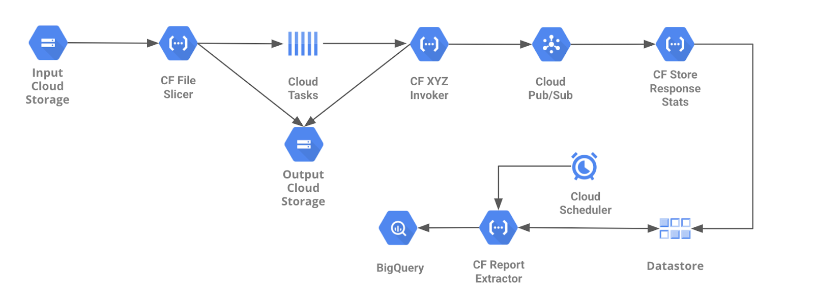

# Centimani - Internal Details and Advanced Features

## How does it work in detail

In order to use this system, the first step is to upload one or more “big files” into the input Google Cloud Storage Bucket. Automatically, the File Slicer Cloud Function will be triggered and split each of these big files into smaller chunks (with the configured number of lines). Then, a task will be queued in Cloud Tasks to send the location of each chunk to the invoker component.

The Cloud Tasks will use HTTP to trigger multiple instances of the Invoker Cloud Function in parallel. Each of these triggers will come with the location of a chunk, that will be pre-processed, if required, and then passed as part of the invocation of the target API. At this point, details about responses and errors returned by the API will be sent to the “Store Response Stats” Cloud Function using Pub/Sub, which will store these information in Datastore.

Finally, it is possible to (optional but recommended) set up Google Task Scheduler to periodically trigger a Cloud Function called “Report Extractor”, that will flatten and extract status and error information from Datastore to BigQuery, so it can be properly analyzed or used to provide visual status information about the data processing workflow by using, for example, a dashboard.

There are two invokers provided with the tool (Offline Conversions and Product uploaders), however it is possible to add any other functionality as described in “[how to extend the solution?](#how-to-extend-the-solution?)”



## What’s inside?

Here’s the list of files included as part of the solution:

```text
    ├── cfs
    │   ├── file_slicer
    │   │   ├── deploy.sh
    │   │   ├── main.py
    │   │   ├── requirements.txt
    │   │   └── test_main.sh
    │   ├── gads_invoker
    │   │   ├── deploy.sh
    │   │   ├── main copy.py
    │   │   ├── main.py
    │   │   ├── requirements.txt
    │   │   └── test_main.sh
    │   ├── reporting_data_extractor
    │   │   ├── deploy.sh
    │   │   ├── main.py
    │   │   ├── requirements.txt
    │   │   ├── test_main.sh
    │   └── store_response_stats
    │       ├── deploy.sh
    │       ├── main.py
    │       ├── requirements.txt
    │       ├── test_main.sh
    ├── deploy
    │   ├── config.yaml
    │   ├── deploy.sh
    │   ├── env.sh
    │   ├── gads_config.json
    │   ├── helpers.sh
    │   └── utils
    │       ├── delete_daily_tables.sh
    │       └── delete_sharded_tables.sh
    └── README.md
```

## GCS Structure

```text
    GCS Input Bucket
       |
       \-------------------> input (for file_slicer to read files from)
```

```text
    GCS Output Bucket
       |
       |-------------------> <date>/failed (for failed input files: name error, corrupted…)
       |
       |-------------------> <date>/processed (for files successfully sliced)
       |
       |-------------------> <date>/slices_processing (for slices to be picked by the invoker)
       |
       |-------------------> <date>/slices_processed (for slices successfully processed)
       |
       \-------------------> <date>/slices_failed (for slices with processing errors)
```

## How to extend the solution?

Think of this solution as a massive generic file processor: it can split big files in chunks and process those chunks in parallel (for upload conversion or any other purpose). The general idea is for the file_slicer cloud function to read the platform name from the first token of the file name, get the configuration for that particular platform and create the file chunks for the processor.

Therefore you will need to:

1. Decide on the new name of the platform, from now on: `<platform name>`
2. Duplicate gads_invoker directory:
   1. Rename it to `<platform name in lowercase>_invoker` (in concordance with `deploy/config.yaml`)
   2. Change the following variable in `<platform name in lowercase>_invoker/deploy.sh`:

      ```text
      CF_NAME=$CF_NAME_<platform name in uppercase>_INVOKER
      ```

3. Change `<platform name in lowercase>_invoker/main.py` and include the desired functionality.

   Make sure you:
   - Reply with “200 OK” when the process is completed correctly or failed with a non retriable error (wrong data or max retry attempts reached)
   - Reply with “Error 500” when a retriable error happened.
   - Move the file to the right GCS directory after processing it (slices_failed or processed).
   - Send the outcome of the file processing to the `store_response_stats` cloud function (look for `_add_errors_to_input_data` and `_send_pubsub_message` functions in main.py).

4. Duplicate `_gads_config.json` and rename it to `<platform name in lowercase>_config.json`
   The file needs a minimum of 2 sections:
   - slicer: containing the configuration for the file_slicer
   - queue_config: containing the parameters for the Cloud Task queue which will manage the requests

   Add any section you would need (Credentials or any other).
   The file will be automatically uploaded to a secret in GCP by the deployment script.

   Sample file for GAds:

    ```json
    {
      "slicer" : {
          "max_chunk_lines": 2000
      },
      "queue_config": {
        "name": "gads-conversions-upload",
        "rate_limits": {
          "max_dispatches_per_second": 100,
          "max_concurrent_dispatches": 2000
        },
        "retry_config": {
          "max_attempts": 5,
          "max_retry_duration": 1750,
          "min_backoff": 10,
          "max_backoff": 300,
          "max_doublings": 3
        }
      },
      "credentials": {
        "XXXXXX": {
          "developer_token": "",
          "client_id": "",
          "client_secret": "",
          "refresh_token": "",
          "login_customer_id": "XXXXXX"
        },
        "YYYYYY": {
          "developer_token": "",
          "client_id": "",
          "client_secret": "",
          "refresh_token": "",
          "login_customer_id": "YYYYYY"
        }
      }
    }
    ```

## Daily Progress & Historical Reports

The following query can be used to get a status report of the upload process:

```sql
SELECT
  _TABLE_SUFFIX AS processing_date,
  parent_file_date AS data_date,
  parent_file_name as file,
  max(parent_total_files) as num_files,
  count(1) as processed_files,
  max(parent_total_rows) total_rows,
  sum(child_num_rows) processed_rows,
  sum(child_num_errors) num_errors
FROM `<project>.<dataset>.daily_results_*`
WHERE
  target_platform = '<PLATFORM>'
GROUP BY
    parent_file_name,
    parent_file_date,
```

A slightly modified version of this query can also be used to power a DataStudio dashboard (or any similar tool) to display the status of the upload process. In the case of DataStudio, you can use Date variables to filter by data range by defining a custom query like the one below as datasource, and enabling the date parameters in the configuration screen:

```sql
SELECT
  _TABLE_SUFFIX AS processing_date,
  parent_file_date AS data_date,
  parent_file_name as file,
  max(parent_total_files) as num_files,
  count(1) as processed_files,
  max(parent_total_rows) total_rows,
  sum(child_num_rows) processed_rows,
  SUM(child_num_errors) num_errors
FROM `<project>.<dataset>.daily_results_*`
WHERE
  target_platform = '<PLATFORM>' AND
  _TABLE_SUFFIX BETWEEN @DS_START_DATE AND @DS_END_DATE
GROUP BY
    parent_file_name,
    parent_file_date,
    _TABLE_SUFFIX
```

## Housekeeping

### Google Cloud Storage clean up

- A dated directory is created everyday, you may want to clean old ones up at a certain point in time.

### Datastore clean up

- In case you need to delete datastore entities, you’ll need to create your own script to query entities to be deleted and iterate through them.

### BigQuery clean up

- In case you need to delete daily BigQuery sharded tables, you can use the script _delete_daily_tables.sh_ included in the utils directory

## Data Model

### Datastore

#### Entities Hierarchy

```text
processing_date < child_file
```

#### processing_date Data Model

```text
name/id: string in YYYYMMDD format
```

### child_file Data Model

Key(processing_date)

```json
{
  date: string (format YYYYMMDD),
  target_platform: string enum [“gads” | “cm” |...],
  parent: {
  cid: string,
    file_name: string,
  file_path: string,
    file_date: string (YYYYMMDD),
    total_files: int,
    total_rows: int
  },
  child: {
    file_name: string,
    num_rows: int,
    num_errors: int,
    errors: [{
      code: string,
      message: string,
      count: int
    }]
  }
}
```

### BigQuery Data Model

Table `daily_report_YYYYMMDD`:

| Field Name               | Type      | Mode     |
|--------------------------|-----------|----------|
| parent_total_rows        | INTEGER   | REQUIRED |
| parent_total_files       | INTEGER   | REQUIRED |
| child_num_errors         | INTEGER   | REQUIRED |
| child_num_rows           | INTEGER   | REQUIRED |
| parent_file_path         | STRING    | REQUIRED |
| parent_file_name         | STRING    | REQUIRED |
| processing_date          | STRING    | REQUIRED |
| child_file_name          | STRING    | REQUIRED |
| target_platform          | STRING    | REQUIRED |
| last_processed_timestamp | TIMESTAMP | REQUIRED |
| parent_file_date         | STRING    | REQUIRED |
| cid                      | STRING    | REQUIRED |
| child_errors             | RECORD    | REPEATED |
| child_errors.code        | STRING    | REQUIRED |
| child_errors.count       | STRING    | REQUIRED |
| child_errors.message     | STRING    | REQUIRED |