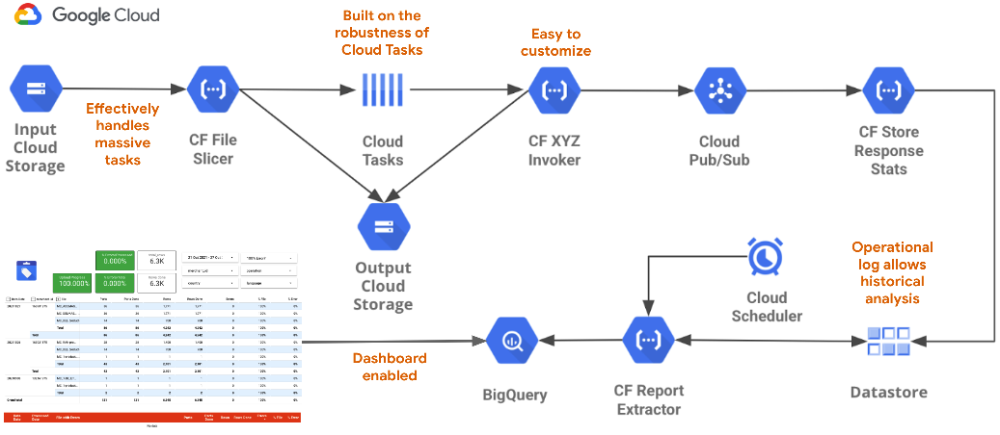
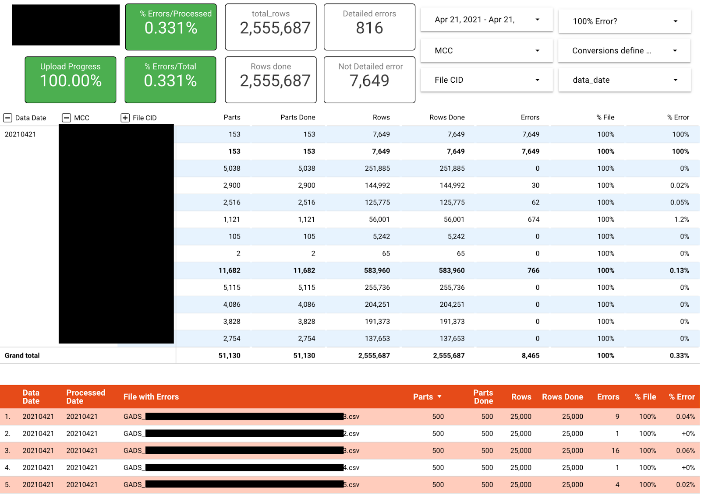
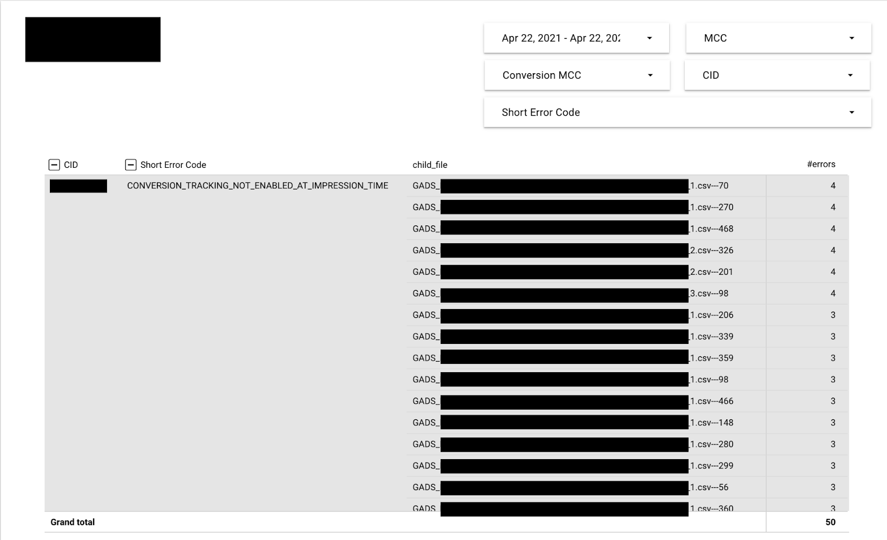

# Centimani - User & Developer Guide

## What’s Centimani?

Centimani is a configurable massive file processor able to split text files in chunks, process them following a strategic pattern and store the results in BigQuery for reporting. It provides configurable options for chunk size, number of retries and takes care of exponential backoff to ensure all requests have enough retries to overcome potential temporary issues or errors.

In its default version, Centimani comes with two main features (or operators):

- Google Ads offline conversions upload using Google Ads API
- Merchant Center product upload using Content API

The solution can be easily extended, you can find all the details [here](INTERNALS.md#how-to-extend-the-solution?).

## How does it work?

Centimani uses **Cloud Tasks** to parallelize up to thousands of API calls with small payloads, reducing the processing time for big input files. It uses **Secret Manager** to store all sensitive credentials and Datastore to keep an updated report on the progress of the data processing workflow. Finally, reporting status information is sent to **BigQuery**, so it can be analyzed and/or visualized.



From a user's perspective, this will be the workflow the tool follows for each execution:

- A file is uplodaded to the input bucket in **Cloud Storage** (information about file syntax and formats [here](#input-files-naming-convention-and-formats)).
- A **Cloud Function** is triggered, and the file is categorized to be processed by one of the operators,
  and is splitted in smaller files.
- A series of tasks are created in **Cloud Tasks** to be launched in parallel in a controlled manner. These tasks
  call the specific function for the selected operator.
- The results of each call are stored in Datastore, and then transfered to BigQuery for reporting.

Everything Centimani does can be audited. As the information from all the operations is
stored in BigQuery, a dashboard can be created to monitor the operations and see the error
details in case any of them failed. You can see a couple of examples below.





## How to deploy?

### Preparation Steps

1. Edit the `terraform.tfvars` file inside the `terraform` directory and configure your
solution and cloud project settings.

   `PROJECT_ID` & `REGION`: The name of your Google Cloud project and the corresponding
   region.

   `DEPLOYMENT_NAME` & `SOLUTION_PREFIX`: These values will be used to build the name of
   every artifact, so no collision with other deployments may happen.

   `SERVICE_ACCOUNT`: The service account to use. It will be created if it does not exist.
   Add it without any domain. It must be 6 to 30 char long.

   `BQ_REPORTING_DATASET`, `BQ_REPORTING_TABLE` & `BQ_GCP_BROAD_REGION`: The name of the
   BigQuery dataset, reporting table and the region where the BigQuery data will be stored.
   
   `INPUT_GCS_BUCKET`, `OUTPUT_GCS_BUCKET` & `BUILD_GCS_BUCKET`: The cloud storage buckets
   to receive input files and store results, and to build the cloud functions at deployment
   time.
   
   `REPORTING_DATA_EXTRACTOR_TOPIC` & `STORE_RESPONSE_STATS_TOPIC` : The name of the
   pubsub topics used to trigger the reporting functions.

   `CREATE_FIRESTORE` & `FIRESTORE_REGION` : In case no Datastore or Firestore database
   has been created in the GCP Project (this should be the case for newly created ones),
   please define `CREATE_FIRESTORE` as `true` to let the deployment script create it, and
   specify the desired region (`us-central` or `europe-west`).

   `CACHE_TTL_IN_HOURS`: For specific operators using cache, this specifies the TTL of it.

Sample configuration file:

   ```text
   PROJECT_ID = "centimani-project"
   REGION     = "europe-west1"
   
   DEPLOYMENT_NAME = "production"
   SOLUTION_PREFIX = "product-uploader"
   SERVICE_ACCOUNT = "centimani-sa"

   BQ_REPORTING_DATASET = "centimani"
   BQ_REPORTING_TABLE   = "daily_results"
   BQ_GCP_BROAD_REGION  = "EU"

   INPUT_GCS_BUCKET  = "centimani_input_bucket_896745"
   OUTPUT_GCS_BUCKET = "centimani_output_bucket_896745"
   BUILD_GCS_BUCKET  = "centimani_build_bucket_896745"

   REPORTING_DATA_EXTRACTOR_TOPIC = "reporting_data_extractor_topic"
   STORE_RESPONSE_STATS_TOPIC     = "store_response_stats_topic"

   CREATE_FIRESTORE = true
   FIRESTORE_REGION = "europe-west"

   CACHE_TTL_IN_HOURS = "2"
   ```

2. Add particular settings for **Google Ads Offline Conversions Uploader**:

   1. Edit the Google Ads credentials in the `gads_config.json` file, inside the `config` directory.
   2. Edit and replace the following variables in the `gads_config.json` file: *(Replace XXXXX with the customer id you want to login as. This value is used for looking up the conversion action ids)*
      - `credentials.XXXXX.developer_token:` the GAds developer token
      - `credentials.XXXXX.client_id:` the OAUTH2 client id
      - `credentials.XXXXX.client_secret:` the OAUTH2 client secret
      - `credentials.XXXXX.refresh_token:` the OAUTH2 client refresh token
      - `credentials.XXXXX.login_customer_id:` the id of the customer to login as. It has to be the same value as XXXXX

   3. Edit (if required) the performance variables `gads_config.json` file:
      - `slicer.max_chunk_lines:` the number of lines on each file chunk excluding the header (default 2000)
      - `queue_config.name:` the name of the queue for the gads operator (default gads-conversions-upload)
      - `queue_config.max_dispatches_per_second:` number of request to gads operator per second (default 100)
      - `queue_config.max_concurrent_dispatches:` max number of tasks in parallel (default 2000)
      - `queue_config.retry_config.max_attempts:` max retry attempts (default 5)
      - `queue_config.retry_config.max_retry_duration:` max retry duration (default 1750)
      - `queue_config.retry_config.min_backoff:` lower bound in seconds for exponential backoff (default 10)
      - `queue_config.retry_config.max_backoff:` upper bound in seconds for exponential backoff (default 300)
      - `queue_config.retry_config.max_doublings:` how many times the time between retries will be doubled (default 3)

   4. When configuring the settings, please take these tips into consideration:

    - For Google Ads conversions uploading, take into account that the maximum number of conversions in each upload is currently 2,000 but the timeout is currently set to 60 seconds, so we recommend to send a lower number of conversions in each request (around 50), until this discrepancy is fixed.
    - Service account names (the part before the @) must be between 6 and 30 chars long. If it’s a new service account, please don’t include the domain. Otherwise, if you are reusing a service account formerly created, then you should include it.
    - Input and output GCS buckets will be automatically created if they don’t exist already. Please take into account that bucket names are unique across Google, so you may choose a name already in use in another project. If this is the case, you will need to choose a different name for the deployment to succeed.
    - Cloud Function names are limited to 63 chars max. Please do not choose a long deployment name and solution prefix, or the deployment will fail.
    - During the deployment of the schedulers, you may be asked to deploy an App Engine. If that’s the case, just say “Y”es and choose the same location that you used in the configuration file. This App Engine will be used to provide the Cloud Task Scheduler functionality.
    - Delete the file \*_config.json after completing the deployment, in order to avoid making sensitive information available in your deployment system.

3. Add particular settings for **Merchant Center Products Uploader**:

   1. Edit the Merchant Center credentials in the `mc_config.json` file, inside the `config` directory.
   2. If you already have a service account available in your Google Cloud project,
   download the API key in json format, and include it in the credential section. If you
   haven't created the service account yet, the deployment script will do that for you.
   After the deployment is done, return to this step and add it to the `mc_config.json`file.
   3. Authorize your service account to manage your Merchant Center account. You can do
   this both at individual level, or at MCA level. If you haven't created the service
   account yet, do this step after the deployment is done.
   4. Repeat steps 1 and 2 if you want to create separated access for different accounts
   within the same tool (you can create different credentials in the file, and select which
   one to use at runtime).

### Deployment

Centimani uses a centralized deployment script based on terraform which will deploy
each of the components.
In order to start the process, once the configuration files is ready, just run the
deployment script from the root folder of Centimani:

```sh
bash deploy.sh
```

The deployment script will grant permissions, enable services and create all Google Cloud
resources required forCentimani to run.

Progress in displayed on the screen, so please take a look for any issues reported during
the deployment process. You may re-run the script after fixing any reported issue in order
to ensure a healthy installation of the solution.

After the execution, terraform saves the state in a file called `terraform.tfstate`
in the terraform directory. This will allow you to update quickly any resource that
had changed after the initial deployment (think of configuration changes or centimani
version upgrades). We strongly recommend you to store this file for future updates
otherwise you would need to do manual import operations to get the terraform state
back in sync before being able to update the deployment.

### Updating the Deployment

If you have already deployed the solution but only want to update the configuration or the cloud functions, you can just run the deployment script again (make sure your
`terraform.tfstate` file is in the terraform directory).

```sh
bash deploy.sh
```

## Maintenance

- A dated directory is created everyday in the output bucket, you may want to
  create a rule to delete the older files.
- In case you need to delete datastore entities, you’ll need to create your own
  script to query entities to be deleted and iterate through them.
- BigQuery sharded tables have a default expiration date of 30 days, which is
  defined in the `terraform/main.tf` file. You can modify this value in the file
  and deploy it, or manually in the dataset definition in the cloud console.


## Troubleshooting

- There are files in the ‘failed’ GCS directory.

  Check for errors in the file name pattern.

- The number of files I uploaded to GCS do not match with the ones in BigQuery.
  
  Check the scheduler and make sure the associated Cloud Function is running correctly.
  
  Check if there are  memory exhaustion errors on reporting_data_extractor cloud function. If so, increase the allocated memory for the Cloud Function.
  
  If you built your own operator, make sure that all errors are handled correctly

- In BigQuery I find more slices and with a different num of rows than than configured.
  
  Have you changed the slicing parameters and reprocessed the file on the same day? If so, it’s normal. Clean the entries for that file in BigQuery and reprocess it.

- File slicing phase takes too long.
  
  Consider uploading smaller files, or creating bigger chunks. (The benchmark we have for GAds conversion upload is 100 input files with 25K records each, split into 50 record files, taking less than 1 hour end to end processing time)
  
  Consider increasing the allocated memory for the Cloud Function to 2GB (you can do it in _cfs/file_slicer/deploy.sh_).

- The operator does not seem to work properly.
  
  Check the Cloud Function logs and make sure that you are not running out of memory (due to the size of the data in Datastore, for example) and the API invocations and returns are working properly.

- I can’t see all of the information from Datastore in BigQuery.
  
  Make sure that the “Report Extractor” Cloud Function is not running out of memory. Otherwise, increase the allocated memory to prevent this situation.

- Why are there separate input and output buckets?
  
  GCS sends finalize events to file_slicer for every object created. This means that using a single bucket would trigger the slicer every time a file slice is written by the slicer or when a file is moved to another directory, generating hundreds of thousands of unnecessary (and charged beyond the free quota) calls. Separating the logic into 2 buckets resolves the unnecessary calls.

## Additional Reference

### Input Files Naming Convention and Formats

Each operator has its own specific syntax to handle filenames. The only part
that is fixed is the initial prefix, that indicates which operator is going to
be used. Also, underscores characters are used as field separators.

For the standard operators included with this solution, the values are:

- `GADS`: Google Ads Offline Conversions Uploader
- `MC`: Merchant Center Products Uploader

You can find below the specific syntax used by each of these operators.

#### Google Ads Offline Conversions Uploader

```text
GADS_<free text no underscore allowed>_<CID where conversions are observed>_<MCC where developer token is defined>_<CID where conversions are defined>_<date string in YYYYMMDD format>_<free text>.csv
```

Where:

1. \<free text no underscore allowed>: use these fields to describe the purpose of the file or add any additional information. You may include customer name, conversion name, etc. Please do not use underscores, since they are used as separators.
2. \<CID where conversions are observed>: the account where the cids are captured.
3. \<MCC where developer token is defined>: the MCC account where we could find the developer token to be used.
4. \<CID where conversions are defined>: the account where the conversion actions are defined.
5. \<date string in YYYYMMDD format>: The date in YYYYMMDD format
6. \<free text> any text

All these details are required because the gAds Operator module needs to obtain the conversion action id from the conversion action name, and then upload the conversions at the right level.

#### Merchant Center Products Uploader

```text
MC_<free text no underscore allowed>_<date string in YYYYMMDD format>.json
```

Where:

1. \<free text no underscore allowed>: use these fields to describe the purpose of the file or add any additional information. You may include customer name, store, etc. Please do not use underscores, since they are used as separators.
4. \<Credential's name>: the name of the credentials to use, as defined in the configuration of the tool.
5. \<date string in YYYYMMDD format>: The date in YYYYMMDD format

For example,

```text
MC_MY-SOMETHING_default_20210421_clothes-store.json
```

The file must be in json format, where each line is a self-contained batch item
prepared for the Content API for shopping. This allows the tool to do the split operation more efficiently.

Following is an example of a batch item, expanded to several lines just for visualization:

```json
{
  "batchId":123,
  "merchantId":"12345678",
  "method":"insert",
  "product":{
    "id":"online:es:ES:MY-ID-123",
    "offerId":"MY-ID-123",
    "title":"My Awesome Product","link":"...",
    "price":{"value":10,"currency":"EUR"},
    "description":"...",
    //...
  }
}
```

The expected format for this particular item in the input file should be this (all in a single line):

```json
{ "batchId":123, "merchantId":"12345678", "method":"insert", "product":{ "id":"online:es:ES:MY-ID-123", "offerId":"MY-ID-123", "title":"My Awesome Product","link":"...", "price":{"value":10,"currency":"EUR"}, "description":"...", ... } }
```

The specific format would depend on the type of operation to be performed, but it must
be compliant with the format required by the Content API.
